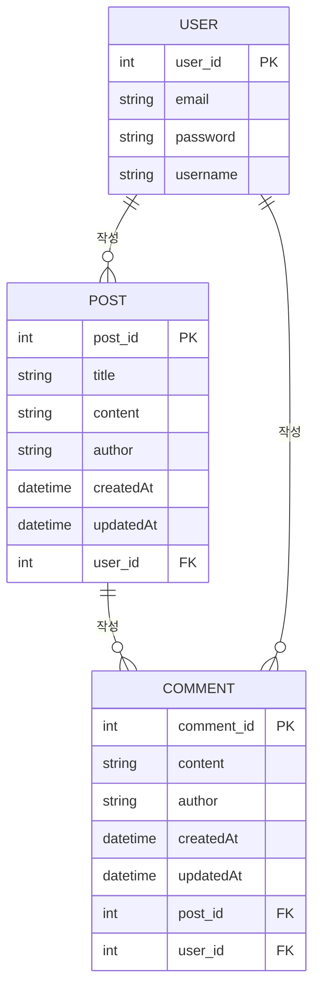

# mini-board-server
게시판 - 사이드 프로젝트 백엔드 서버

# 요구사항 분석 및 설계

## 프로젝트 개요
- 웹의 기본이 될 수 있는 Create,Read,Update,Delete 기능을 포함한 게시판을 만든다.

- 프로젝트명 : mini-board-server
- 개발 기간 : 2023.05.15 ~ 2023.05.28
- 주요 기능
    - 게시판 - Create, Read, Update, Delete 기능, 페이징 처리, 검색 기능
    - 유저 - 로그인, 회원가입, 회원정보 수정
    - 댓글 - Create, Read, Update, Delete 기능

## 필요 기술 분석

- Spring Web
- Spring Data JPA
- QueryDSL
- Spring Security
- Lombok
- MySQL
- Spring Validation
- logback

## 요구사항 정의

게시글, 유저, 댓글에 대해서만 우선적으로 요구사항을 정리한다.

이 후 점진적으로 프로젝트의 요구사항을 늘릴 예정

### 게시글 요구사항

- **게시글 작성**
    - 게시글 제목, 내용, 작성자, 작성일시 등의 정보를 포함
    - 게시글을 작성하여 데이터베이스에 저장
- **게시글 조회**
    - 모든 게시글 목록 조회
    - 특정 게시글 조회 (게시글 ID를 사용)
- **게시글 수정**
    - 게시글의 제목과 내용을 수정
    - 게시글 수정 시 수정일시 업데이트
- **게시글 삭제**
    - 특정 게시글 삭제 (게시글 ID를 사용)
- **로그인하지 않은 상태에서 접근할 수 있는 페이지**
    - 로그인 페이지
    - 회원가입 페이지
    - 게시판 목록 조회 페이지
    - 게시판 상세보기 페이지
    - 이 외 다른 페이지 이동 시 로그인 페이지로 이동
    

### 댓글 요구사항

- **댓글 작성**
    - 특정 게시글에 댓글 작성
    - 댓글 내용, 작성자, 작성일시 등의 정보를 포함
- **댓글 조회**
    - 특정 게시글의 댓글 목록 조회
- **댓글 수정**
    - 댓글의 내용을 수정
    - 댓글 수정 시 수정일시 업데이트
- **댓글 삭제**
    - 특정 댓글 삭제 (댓글 ID를 사용)

### 사용자 요구사항

- **사용자 등록**
    - 사용자 이름, 이메일, 비밀번호 등의 정보를 포함
    - 사용자 정보 등록
- **사용자 인증**
    - 사용자 로그인 기능 (이메일과 비밀번호 사용)
    - 인증된 사용자만 게시글과 댓글 작성 가능

### 추가 요구사항

- **페이징 처리**
    - 게시글 목록 조회 시 페이징 처리.
    - 댓글 목록 조회 시 페이징 처리.
- **정렬 기능**
    - 게시글과 댓글을 작성일시 또는 수정일시 기준으로 정렬.
- **검색 기능**
    - 제목, 내용, 작성자 등으로 게시글 검색.
- **유효성 검사**
    - 입력 데이터에 대한 유효성 검사 (제목, 내용, 이메일 형식 등).
- **예외 처리**
    - API 호출 시 발생할 수 있는 예외 처리 (예: 게시글이 존재하지 않음, 권한 없음 등).
- **보안**
    - JWT 또는 OAuth2를 사용한 인증 및 권한 부여.
    - 비밀번호 암호화.
    

## REST API 설계

### **게시글 API**

- **POST /api/posts**: 게시글 작성
- **GET /api/posts**: 게시글 목록 조회 (페이징 및 정렬 가능)
- **GET /api/posts/{id}**: 특정 게시글 조회
- **PUT /api/posts/{id}**: 게시글 수정
- **DELETE /api/posts/{id}**: 게시글 삭제

### **댓글 API**

- **POST /api/posts/{postId}/comments**: 댓글 작성
- **GET /api/posts/{postId}/comments**: 특정 게시글의 댓글 목록 조회 (페이징 및 정렬 가능)
- **PUT /api/posts/{postId}/comments/{commentId}**: 댓글 수정
- **DELETE /api/posts/{postId}/comments/{commentId}**: 댓글 삭제

### **사용자 API**

- **POST /api/users**: 사용자 등록
- **POST /api/auth/login**: 사용자 로그인

## 요청/응답 메시지 포멧

### **게시글 API**

- **POST /api/posts**
    - Request Body: **`{"title": "Example", "content": "This is an example post.", "author": "Author Name"}`**
    - Response: **`201 Created`**, **`{"id": 1, "title": "Example", "content": "This is an example post.", "author": "Author Name", "createdAt": "2023-05-15T10:00:00", "updatedAt": "2023-05-15T10:00:00"}`**
- **GET /api/posts**
    - Response: **`200 OK`**, **`[{"id": 1, "title": "Example", "content": "This is an example post.", "author": "Author Name", "createdAt": "2023-05-15T10:00:00", "updatedAt": "2023-05-15T10:00:00"}, ...]`**
- **GET /api/posts/{id}**
    - Response: **`200 OK`**, **`{"id": 1, "title": "Example", "content": "This is an example post.", "author": "Author Name", "createdAt": "2023-05-15T10:00:00", "updatedAt": "2023-05-15T10:00:00"}`**
- **PUT /api/posts/{id}**
    - Request Body: **`{"title": "Updated Title", "content": "Updated content."}`**
    - Response: **`200 OK`**, **`{"id": 1, "title": "Updated Title", "content": "Updated content.", "author": "Author Name", "createdAt": "2023-05-15T10:00:00", "updatedAt": "2023-05-15T12:00:00"}`**
- **DELETE /api/posts/{id}**
    - Response: **`204 No Content`**

### **댓글 API**

- **POST /api/posts/{postId}/comments**
    - Request Body: **`{"content": "This is a comment.", "author": "Commenter Name"}`**
    - Response: **`201 Created`**, **`{"id": 1, "postId": 1, "content": "This is a comment.", "author": "Commenter Name", "createdAt": "2023-05-15T10:00:00", "updatedAt": "2023-05-15T10:00:00"}`**
- **GET /api/posts/{postId}/comments**
    - Response: **`200 OK`**, **`[{"id": 1, "postId": 1, "content": "This is a comment.", "author": "Commenter Name", "createdAt": "2023-05-15T10:00:00", "updatedAt": "2023-05-15T10:00:00"}, ...]`**
- **PUT /api/posts/{postId}/comments/{commentId}**
    - Request Body: **`{"content": "Updated comment."}`**
    - Response: **`200 OK`**, **`{"id": 1, "postId": 1, "content": "Updated comment.", "author": "Commenter Name", "createdAt": "2023-05-15T10:00:00", "updatedAt": "2023-05-15T12:00:00"}`**
- **DELETE /api/posts/{postId}/comments/{commentId}**
    - Response: **`204 No Content`**

### **사용자 API**

- **POST /api/users**
    - Request Body: **`{"username": "user", "email": "user@example.com", "password": "password"}`**
    - Response: **`201 Created`**, **`{"id": 1, "username": "user", "email": "user@example.com"}`**
- **POST /api/auth/login**
    - Request Body: **`{"email": "user@example.com", "password": "password"}`**
    - Response: **`200 OK`**, **`{"token": "jwt-token"}`**
    

## 데이터 모델링

실제 ERD를 그리기전에 필요한 데이터와 타입을 추출한다.

### 게시글(Post)

- id: Long
- title: String
- content: String
- author: String
- createdAt: LocalDateTime
- updatedAt: LocalDateTime

### 댓글(Comment)

- id: Long
- postId: Long (foreign key)
- content: String
- author: String
- createdAt: LocalDateTime
- updatedAt: LocalDateTime

### **사용자 (User)**

- id: Long
- email: String
- password: String (암호화된 형태)
- username: String
- roles: Set<Role> (예: USER, ADMIN)

## 테이블 설계

1. **USER** 테이블
    - **`user_id`**: 기본 키 (Primary Key)
    - **`username`**: 사용자 이름
    - **`email`**: 이메일 주소
    - **`password`**: 비밀번호
2. **POST** 테이블
    - **`post_id`**: 기본 키 (Primary Key)
    - **`title`**: 게시글 제목
    - **`content`**: 게시글 내용
    - **`author`**: 작성자 (사용자 이름)
    - **`createdAt`**: 생성 시간
    - **`updatedAt`**: 수정 시간
    - **`user_id`**: 외래 키 (Foreign Key)로 사용자 참조
3. **COMMENT** 테이블
    - **`comment_id`**: 기본 키 (Primary Key)
    - **`content`**: 댓글 내용
    - **`author`**: 작성자 (사용자 이름)
    - **`createdAt`**: 생성 시간
    - **`updatedAt`**: 수정 시간
    - **`post_id`**: 외래 키 (Foreign Key)로 게시글 참조
    - **`user_id`**: 외래 키 (Foreign Key)로 사용자 참조

### **관계 설명**

- **USER**와 **POST**: 한 사용자는 여러 개의 게시글을 작성할 수 있습니다. (**`USER`** 1:다 **`POST`**)
- **POST**와 **COMMENT**: 한 게시글에는 여러 개의 댓글이 달릴 수 있습니다. (**`POST`** 1:다 **`COMMENT`**)
- **USER**와 **COMMENT**: 한 사용자는 여러 개의 댓글을 작성할 수 있습니다. (**`USER`** 1:다 **`COMMENT`**)

